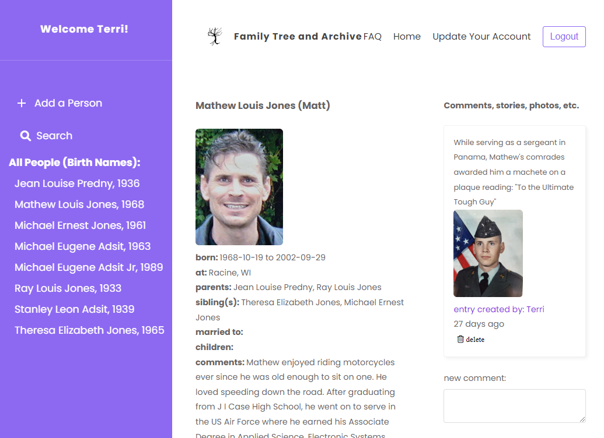
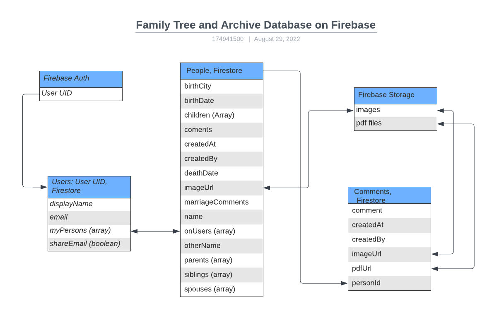

# Family Tree and Archive:

A web app available for use at https://familytreeandarchive.com/ where you are able to record family stories, facts, geneology, photos and pdf files that allows others to add their own comments and photos. Here is a sample screen of a person and added comment.

## Created Using:
This project was created with React, JavaScript, Firebase, NotiStack's EnQueue SnackbarProvider and Emailjs then thoroughly tested with Cypress. 

## Some Interesting Code:
Perhaps updateARelative is the most utilized function. Every time a person has relatives added or updated, their relatives also need corresponding updates. Additionally, when a person is deleted, all of their relatives need this person deleted as a relative. [updateARelative](src/manageFileStorage/updateARelative.js)

getPeopleFromIds is interesting because it provides an opportunity to use the Promise.all method. [getPeopleFromIds](src/manageFileStorage/getPeopleFromIds.js)

The page I most desire feedback regarding possible consolidation of code is the AddRelatives page. With four types of relatives to manage, not repeating code is extremely important. I would value an opinion on a more succinct method of setting up the multiple props and updating multiple relatives. One aspect of the page feels triumphant: finding and using the action.action property on the React Select component in the docs is not easy! [AddRelatives](src/pages/addRelatives/AddRelatives.js)

While the custom hooks are well done, I cannot claim credit for their code. They are from a React class I took with the 'NetNinja' on Udemy as is the AuthContext. My part was to update them to work with the latest version of Firebase.

The compressImage.js code is also largely others code from an article by Mirco Bellagamba.

## Database Structure
While Firebase storage has a document structure database, the Ids generated by Firebase are used to connect persons as relatives and to comments as a relational database would do.

To limit data queries, relatives names are also stored in arrays along with ids.

## Cypress Testing
Rather than use Cypress' new component testing capabilities, I test each component in the e2e suite. For this application, it seems that too many functions and components needed to be imported for each component test. Switching to the e2e environment bypassed this extra work completely. The Cypress Testing was excellent for confirming error handling is functioning correctly. All tests are in Cypress/e2e/ [Cypress](cypress/e2e/)

## Why I built the project this way:
* To spend time solidifying my programming skills in React, Firebase, JavaScript and Cypress.
* The Comments Database is seperate from People to allow for easy updating of createBy Display Name which is stored along with the UserId in each comment. This seemed more straightforward than searching all comments within each person.

## If I had more time I would:
* Spend more time on styles. In particular, date formats.
* Worked on a clickable diagram layout of relatives.
* Consider a database with comments incorporated into the people database.
* Have learned node more completely to manage firebase authorizations (taking a second node class now).

## I wish I had:
* Used a linter for consistent code style.

Please enjoy the website! 

## Available Scripts

In the project directory, you can run:

### `npm start`

Runs the app in the development mode.\
Open [http://localhost:3000](http://localhost:3000) to view it in the browser.

The page will reload if you make edits.\
You will also see any lint errors in the console.

### `npm test`

Launches the test runner in the interactive watch mode.\
See the section about [running tests](https://facebook.github.io/create-react-app/docs/running-tests) for more information.

### `npm run build`

Builds the app for production to the `build` folder.\
It correctly bundles React in production mode and optimizes the build for the best performance.

The build is minified and the filenames include the hashes.\
Your app is ready to be deployed!

See the section about [deployment](https://facebook.github.io/create-react-app/docs/deployment) for more information.

### `npm run eject`

**Note: this is a one-way operation. Once you `eject`, you can’t go back!**

If you aren’t satisfied with the build tool and configuration choices, you can `eject` at any time. This command will remove the single build dependency from your project.

Instead, it will copy all the configuration files and the transitive dependencies (webpack, Babel, ESLint, etc) right into your project so you have full control over them. All of the commands except `eject` will still work, but they will point to the copied scripts so you can tweak them. At this point you’re on your own.

You don’t have to ever use `eject`. The curated feature set is suitable for small and middle deployments, and you shouldn’t feel obligated to use this feature. However we understand that this tool wouldn’t be useful if you couldn’t customize it when you are ready for it.

## Learn More

You can learn more in the [Create React App documentation](https://facebook.github.io/create-react-app/docs/getting-started).

To learn React, check out the [React documentation](https://reactjs.org/).

### Code Splitting

This section has moved here: [https://facebook.github.io/create-react-app/docs/code-splitting](https://facebook.github.io/create-react-app/docs/code-splitting)

### Analyzing the Bundle Size

This section has moved here: [https://facebook.github.io/create-react-app/docs/analyzing-the-bundle-size](https://facebook.github.io/create-react-app/docs/analyzing-the-bundle-size)

### Making a Progressive Web App

This section has moved here: [https://facebook.github.io/create-react-app/docs/making-a-progressive-web-app](https://facebook.github.io/create-react-app/docs/making-a-progressive-web-app)

### Advanced Configuration

This section has moved here: [https://facebook.github.io/create-react-app/docs/advanced-configuration](https://facebook.github.io/create-react-app/docs/advanced-configuration)

### Deployment

This section has moved here: [https://facebook.github.io/create-react-app/docs/deployment](https://facebook.github.io/create-react-app/docs/deployment)

### `npm run build` fails to minify

This section has moved here: [https://facebook.github.io/create-react-app/docs/troubleshooting#npm-run-build-fails-to-minify](https://facebook.github.io/create-react-app/docs/troubleshooting#npm-run-build-fails-to-minify)
# Getting Started with Create React App

This project was bootstrapped with [Create React App](https://github.com/facebook/create-react-app).

It is a web app availble for use at https://familytreeandarchive.com/ where you are able to record family stories, facts, geneology, photos and pdf files.

This was a project to confirm my ability to use React, JavaScript and Firebase to build a useful, fun web app. 

Then I was able to confirm my Cypress skills by thoroughly testing each component. Rather than using Cypress' new component testing capabilities, I tested each component in the e2e suite. For this application, it seemed that too many functions and components needed to be imported for each component test. Switching to the e2e environment bypassed this extra work completely. The Cypress Testing was excellent for confirming error handling was functioning correctly.

Creating a key based NoSQL database in Firebase Firestore was extremely rewarding. The file structure consists of users, people, and comments databases. Users id's are used for indicating createdBy fields. Then as people are created, their ids are linked to comments as well as their id's being added to user's onMyHomePage field. 

An intriguing challenge was keeping family relationships related to one another using PeopleId's and then removing these relationships if people are deleted from the database, lots of fun! All of those async functions gave me lots of practice with async including the Promise.all() method.

Coding this app provided experience upgrading React and Firebase as they changed versions between my React/Firebase Udemy class and my programming this code. I also was able to learn much of the Firebase Auth verification proccess to allow users to change their email address or password which was not covered in my class.

Happily, I was able to try out some fun code like tool tips, dropdowns and exploring some of the React Pointer Events. 
It was exciting to learn to import others work like NotiStack's EnQueue SnackbarProvider and Emailjs! I am grateful for the code published by Mirco Bellagamba that allowed image compression in his article regarding image compression.

Please enjoy the website! 

## Available Scripts

In the project directory, you can run:

### `npm start`

Runs the app in the development mode.\
Open [http://localhost:3000](http://localhost:3000) to view it in the browser.

The page will reload if you make edits.\
You will also see any lint errors in the console.

### `npm test`

Launches the test runner in the interactive watch mode.\
See the section about [running tests](https://facebook.github.io/create-react-app/docs/running-tests) for more information.

### `npm run build`

Builds the app for production to the `build` folder.\
It correctly bundles React in production mode and optimizes the build for the best performance.

The build is minified and the filenames include the hashes.\
Your app is ready to be deployed!

See the section about [deployment](https://facebook.github.io/create-react-app/docs/deployment) for more information.

### `npm run eject`

**Note: this is a one-way operation. Once you `eject`, you can’t go back!**

If you aren’t satisfied with the build tool and configuration choices, you can `eject` at any time. This command will remove the single build dependency from your project.

Instead, it will copy all the configuration files and the transitive dependencies (webpack, Babel, ESLint, etc) right into your project so you have full control over them. All of the commands except `eject` will still work, but they will point to the copied scripts so you can tweak them. At this point you’re on your own.

You don’t have to ever use `eject`. The curated feature set is suitable for small and middle deployments, and you shouldn’t feel obligated to use this feature. However we understand that this tool wouldn’t be useful if you couldn’t customize it when you are ready for it.

## Learn More

You can learn more in the [Create React App documentation](https://facebook.github.io/create-react-app/docs/getting-started).

To learn React, check out the [React documentation](https://reactjs.org/).

### Code Splitting

This section has moved here: [https://facebook.github.io/create-react-app/docs/code-splitting](https://facebook.github.io/create-react-app/docs/code-splitting)

### Analyzing the Bundle Size

This section has moved here: [https://facebook.github.io/create-react-app/docs/analyzing-the-bundle-size](https://facebook.github.io/create-react-app/docs/analyzing-the-bundle-size)

### Making a Progressive Web App

This section has moved here: [https://facebook.github.io/create-react-app/docs/making-a-progressive-web-app](https://facebook.github.io/create-react-app/docs/making-a-progressive-web-app)

### Advanced Configuration

This section has moved here: [https://facebook.github.io/create-react-app/docs/advanced-configuration](https://facebook.github.io/create-react-app/docs/advanced-configuration)

### Deployment

This section has moved here: [https://facebook.github.io/create-react-app/docs/deployment](https://facebook.github.io/create-react-app/docs/deployment)

### `npm run build` fails to minify

This section has moved here: [https://facebook.github.io/create-react-app/docs/troubleshooting#npm-run-build-fails-to-minify](https://facebook.github.io/create-react-app/docs/troubleshooting#npm-run-build-fails-to-minify)
